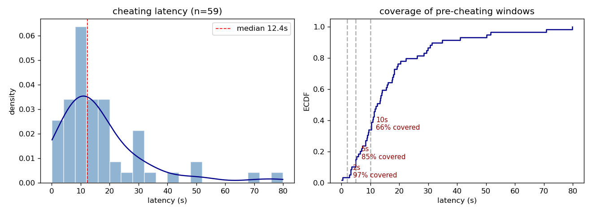
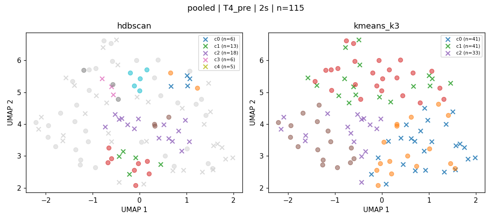
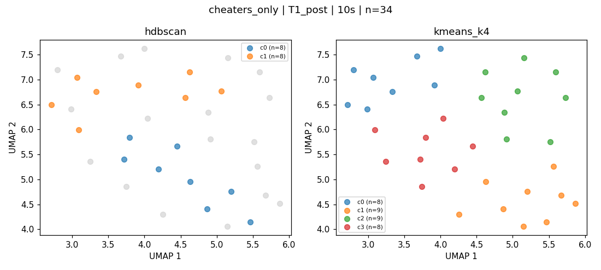

# ChildCheating_Clustering

Re-run of the child-cheating facial micro-expression analysis ). Pipeline: cheating-latency check, temporal slope features for 52 MediaPipe blendshapes across 13 phases × 2/5/10s windows, three-mode UMAP+HDBSCAN clustering, tiered video-verification list.

The previous laptop crash wiped the original code. This repo is the rebuild from scratch.

**Quick read on findings:** [`results/FINDINGS_brief.md`](results/FINDINGS_brief.md).

---

## Data (local, not committed)

| Path | What |
|---|---|
| `output n120_UPDATE2.csv` | 120 IDs, hand-coded behavior events (cheater label, cheating timestamps, E_leaves, etc.) |
| `mediapipe_segmentsoutput/blendshapes/` | one CSV per participant × phase, 52 blendshapes per frame, ~18 GB |

Both sit at the repo root. Scripts assume that layout.

## Environment

```
conda activate D:\Code\envs\childcheat   # or: pip install -r requirements.txt in a venv
```

## Run

```
python scripts/00_inspect_data.py            # data inventory (review before continuing)
python scripts/01_latency_and_extraction.py  # latency + 52-blendshape mean/std/slope features
python scripts/03_umap_clustering.py         # 3-mode clustering + tiered video list
```

Total runtime ~10 min (Script 03 dominates).

---

## Findings

### Cheating latency (n=59 cheaters)

- median **12.4 s**, Q1 8.3 s, Q3 19.4 s, max 80 s, skew 2.1 (long right tail)
- 6 cheaters fall back to Trial 5 start (no `E leaves` event); 1 has no cheating event in the alone window

| window | covers (T5_precheating) |
|---|---|
| 2 s | 57 / 59 (97 %) |
| 5 s | 50 / 59 (85 %) |
| 10 s | 39 / 59 (66 %) |

10-second window loses a third of cheaters and was below the 30-row clustering minimum on `T3_post`. 2 s and 5 s are the safe choices.



### Three-mode clustering on slope features

105 of 117 (mode × phase × window) combos clustered; 12 skipped for `n<30`.

**Mode A: pooled (all kids), clusters with cheater_rate ≥ 65 % and Fisher p < 0.10**

| phase | window | n | cheaters | rate | Fisher p |
|---|---|---|---|---|---|
| **T4_pre** | **2 s** | **18** | **15** | **83 %** | **0.004** |
| T2_post | 2 s | 13 | 11 | 85 % | 0.017 |
| T2_pre | 10 s | 6 | 5 | 83 % | 0.091 |
| **T5_alone** | 5 s | 26 | 18 | 69 % | 0.045 |
| T3_post | 5 s | 15 | 11 | 73 % | 0.100 |

Two structurally different signals show up: a small high-purity cluster in `T4_pre 2 s` (n = 18, 83 %, p = 0.004) at the start of a baseline trial, and a larger more diffuse cluster in `T5_alone 5 s` (n = 26, 69 %, p = 0.045) inside the test trial. The trait-vs-state interpretation cannot be resolved from this alone. All p-values are uncorrected for the 117 clusterings run.



**Mode B: cheaters only (subtypes)**

Multiple small subtypes appear across phases. Example: `T1_post 10s` splits cheaters into 4 small clusters (n = 5 to 9 each), reflecting different post-trial response patterns within the cheater group.



**Mode C: non-cheaters only (control space)**

No high-cheater-rate concept here by construction (all members are coded as non-cheaters). Used as the baseline for tier-3 spotting.

### Video verification list (`results/tables/video_verification_list.csv`)

76 unique IDs across 4 tiers:

| tier | n | what |
|---|---|---|
| tier_1_high_risk | 32 | cheaters in Mode A high-risk clusters; check the cheater pattern visually |
| tier_2_cheater_subtype | 27 | small Mode B subgroups; describe cheater heterogeneity |
| **tier_3_false_negative_candidate** | **10** | non-cheaters appearing in high-risk clusters; possible undetected cheaters |
| tier_4_contrast_control | 7 | random non-cheaters from low-cheater-rate clusters |

Highest-priority tier-3 IDs: **76, 313, 408**. All three landed in the strongest cluster (T4_pre 2s, p = 0.004).

---

## Outputs

```
data/processed/
  temporal_window_tests.csv     # 52 × (mean, std) static features
  temporal_slopes.csv           # 52 slope features (clustering input)
  coverage_report.csv           # phase × window × ID combos skipped (duration<window)

results/tables/
  latency_distribution.csv      # one row per cheater
  latency_summary.csv           # full distribution stats
  window_coverage.csv           # T5_precheating coverage at 2/5/10 s
  cluster_summary.csv           # one row per cluster across all combos
  cluster_skipped.csv           # combos skipped (n<30)
  video_verification_list.csv   # tiered ID list

results/figures/
  latency_distribution.png      # histogram + ECDF with window markers
  umap_{mode}_{phase}_{window}s.png   # 105 plots, one per combo
```

The processed CSVs and the bulk of the UMAP PNGs are gitignored (regenerable from scripts). Only the three figures embedded above are committed.

---


